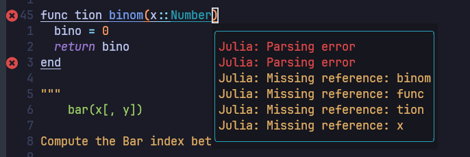
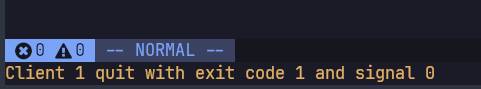

# Setup Julia Repo in GitHub with Actions

## Install Julia

Basically if you are using Linux or Mac, you can easily install Julia by the package manager.
For Gentoo, we can install it with portage as following.

```shell
$ sudo emerge -av julia

```

The problem to install Julia by [Gentoo package manager](https://wiki.gentoo.org/wiki/Portage)
is slow upgrade speed.
In this time, July 27 2023, latest stable version version of Julia in the
[official site](https://julialang.org/downloads/) is 1.9.2 but Gentoo still has
1.8.5 as the latest one.
To overcome this gap, according to the instruction in [Julia GitHub](https://github.com/JuliaLang/julia)
we can easily install it by compiling source.

```shell
$ cd localgit  <-- local git directory
$ git clone https://github.com/JuliaLang/julia.git
$ cd julia
$ git checkout v1.9.2  <-- tag for latest version
$ make
$ ln -s julia ~/.local/bin/julia  <-- This should be earlier path than /usr/bin/julia
```

## Setup Julia language server with formatter for Neovim

!!! info

    This setup is based on cloned
    [Neovim-from-scratch](https://github.com/erdosxx/Neovim-from-scratch/tree/27_Julia_REPL)
    and [Github repo: evoagile_configs](https://github.com/erdosxx/evoagile_configs) repo.

To setup LSP([Language Server Protocol](https://microsoft.github.io/language-server-protocol/)) with
[julials.lua](https://github.com/erdosxx/Neovim-from-scratch/blob/27_Julia_REPL/lua/user/lsp/settings/julials.lua)
file in [Neovim-from-scratch](https://github.com/erdosxx/Neovim-from-scratch/tree/27_Julia_REPL),
we need to setup `nvim-lspconfig` environment first.
Using [stow](https://packages.gentoo.org/packages/app-admin/stow) tool,
we can copy `Makefile` to `~/.julia/environments/nvim-lspconfig/`.

```shell
$ cd localgit/evoagile_configs   <-- if your local cloned repo is in localgit
$ stow -t ~ julia
$ cd ~/.julia/environments/nvim-lspconfig/
$ make
```

After `make` command, `neovim` is launched and open `Example.jl` source file with
some errors. If you wait a moment and no problem occur to install, you can find
some bullets as following screenshot.


Then just quit `neovim` and continue and finish installation.
To test installation, open any example Julia file and change keyword `function` to
`func tion` and at the same line, input `gl`. If you have some bullets and
messages as following, your installation is successful.


If you have any error to load Julia LSP, you can find following errror message in `neovim`.


As you can find in the following, `LanguageServer` package depends on
`JuliaFormatter`, `StaticLint`, and `SymbolServer`. That means we do not have to
install `JuliaFormatter` separately.

```@example
using Pkg
Pkg.add("LanguageServer")

```

To format your code, you can find related commends in
[keymaps.lua](https://github.com/erdosxx/Neovim-from-scratch/blob/27_Julia_REPL/lua/user/keymaps.lua)
file. Type `:Format` in command or `<space key>f`(when `<localleader>` = `<space key>`)
in normal mode, whole code in the file will be formatted.

!!! info

    To get supported to Julia formatting, we can also try to use
    [JuliaFormatter.vim](https://github.com/kdheepak/JuliaFormatter.vim).
    This only supports formatting and no other LSP function but
    range format supporting in visual mode and
    definition of format option in configuration file are possible.
    This uses [JuliaFormatter](https://github.com/domluna/JuliaFormatter.jl)
    independently.
    However, I found that when we use Julia LSP with this package, LSP was
    crashed occasionally. So I decided to uninstall it.

To define format parameters in Julia code is not easy in
[LSP configuration file](https://github.com/erdosxx/Neovim-from-scratch/blob/27_Julia_REPL/lua/user/lsp/settings/julials.lua).
The solution is use ['.JuliaFormatter.toml'](https://domluna.github.io/JuliaFormatter.jl/dev/config/)
file in every repo. So it can be convenient to add this file to
PkgTemplates. (See below section)

!!! info

    The useful configuration to format is
    - style = "sciml"
    - indent = 2
    - margin = 79
    For style options, see [YAS](https://domluna.github.io/JuliaFormatter.jl/dev/yas_style/),
    [Blue](https://domluna.github.io/JuliaFormatter.jl/dev/blue_style/), and
    [SciML](https://domluna.github.io/JuliaFormatter.jl/dev/sciml_style/).

## Use [PkgTemplates](https://github.com/JuliaCI/PkgTemplates.jl) to generate repository

PkgTemplates simplifies the process of setting up the initial file structure for
a new repository, specifically [CI](https://en.wikipedia.org/wiki/Continuous_integration)
integration with GitHub actions.
To use PkgTemplates, we recommend to install it in system default Julia environment,
for example, `v1.9` as following.

```julia
using Pkg
Pkg.activate()   # activate system default env
Pkg.add("PkgTemplates")
```

After installing it, we need to setup the template. It would be convenient to keep it
in the
[`startup.jl`](https://github.com/erdosxx/evoagile_configs/blob/master/julia/.julia/config/startup.jl)
file for easy reuse.
Because this file runs every time Julia starts up, we can utilize the generate
function as shown in the following example.

```@setup genGithubRepo
using Pkg
Pkg.add("PkgTemplates")
using PkgTemplates
using LibGit2
```

```@example genGithubRepo
function genGithubRepo(userName::String, repoName::String)
  templateGithub = Template(;
    user = userName,
    dir = "~/localgit",
    julia = v"1",  # for [compat] section in Project.toml
    plugins = [
      # Use semantic version, See Julia Pattern book page 43.
      ProjectFile(; version = v"1.0.0-DEV"),
      License(; name = "MIT", path = nothing, destination = "LICENSE"),
      Git(;
        branch = LibGit2.getconfig("init.defaultBranch", "master"),
        ssh = true,
        jl = true,
        manifest = false),
      GitHubActions(;
        destination = "CI.yml",
        linux = true,
        osx = false,
        windows = false,
        x64 = true,
        x86 = false,
        coverage = true,
        extra_versions = ["1.8", "1.9", "nightly"]),
      CompatHelper(; destination = "CompatHelper.yml", cron = "0 0 * * *"),
      TagBot(;
        destination = "TagBot.yml",
        trigger = "JuliaTagBot",
        token = Secret("GITHUB_TOKEN"),
        ssh = Secret("DOCUMENTER_KEY"),
        ssh_password = nothing,
        changelog = nothing,
        changelog_ignore = nothing,
        gpg = nothing,
        gpg_password = nothing,
        registry = nothing,
        branches = nothing,
        dispatch = nothing,
        dispatch_delay = nothing),
      Codecov(),
      Documenter{GitHubActions}(logo = Logo(;
        light = homedir() * "/.config/logo/logo.png",
        dark = homedir() * "/.config/logo/logo-dark.png")),
      Dependabot(),
    ])
  generate(templateGithub, repoName)
end

genGithubRepo("ecoinfo", "JuliaStudy.jl")
```

## Use [GitHub-CLI](https://cli.github.com/) to create repository in GitHub

## Playing with REPL

## References

1. [Github repo: evoagile_configs](https://github.com/erdosxx/evoagile_configs)
2. [Github repo: Neovim-from-scratch/27-Julia-REPL](https://github.com/erdosxx/Neovim-from-scratch/tree/27_Julia_REPL)
3. [Setting up Julia lsp for Neovim](https://www.juliabloggers.com/setting-up-julia-lsp-for-neovim/)
4. [discourse: Neovim + LanguageServer.jl](https://discourse.julialang.org/t/neovim-languageserver-jl/37286/63?page=5)
